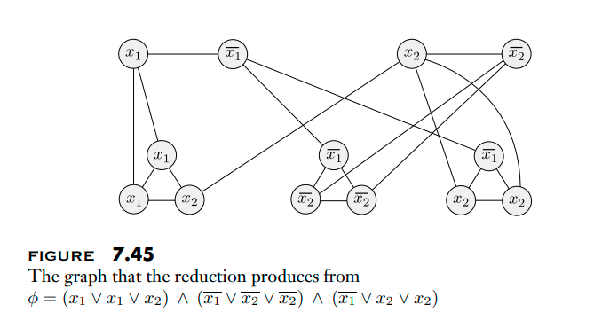
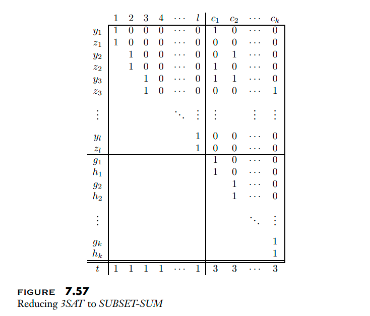

# Week 11, Lecture 1

## The Vertex Cover Problem
<pre>
A vertex cover of G is a subset of the nodes where every edge of G touches one of those nodes if G is an undirected graph. The vertex cover problem asks if a graph has a vertex cover of a given size:
    VERTEX-COVER = {⟨G, k⟩| G is an undirected graph that
                            has a k-node vertex cover}

<b>Theorem: VERTEX-COVER is NP-complete.</b>
Proof:
To demonstrate that VERTEX-COVER is NP-complete, we must first show that it is in NP and that all NP-problems are reducible to it in polynomial time.
The first step is straightforward; a certificate is simply a vertex cover of size k. To demonstrate the second component, we show that 3SAT is reducible to VERTEX-COVER in polynomial time.
The reduction transforms a 3cnf-formula φ into a graph G and a number k such that φ is satisfied whenever G has a vertex cover with k nodes. The conversion is carried out with no knowledge of whether φ is satisfiable. G is, in effect, a simulation of φ. The graph includes gadgets that replicate the formula's variables and clauses.
For the variable gadget, we seek a structure in G that can participate in the vertex cover in one of two ways, corresponding to the variable's two possible truth assignments.
The variable gadget is made up of two nodes that are connected by an edge. Because one of these nodes must be in the vertex cover, that structure works. TRUE and FALSE are randomly assigned to these two nodes.
We seek a structure for the clause gadget that causes the vertex cover to include nodes in the variable gadgets that correspond to at least one true literal in the clause.
The gadget has three nodes and extra edges, therefore any vertex cover must include at least two of the nodes, if not all three. Though one of the variable gadget nodes assists by covering an edge, as if the associated literal meets that clause, just two nodes are necessary.
A total of three nodes would be required otherwise. Finally, we chose k so that the desired vertex cover has one node for each variable gadget and two nodes for each clause gadget.

A Boolean formula φ is reduced to a graph G and a value k. We generate an edge linking two nodes for each variable x in φ. The two nodes in this gadget are labelled x and x'. Setting x to TRUE selects the node labelled x for the vertex cover, whereas setting x to FALSE selects the node named x'.
The clause gadgets are a little more complicated. Each clause gadget is a triple of nodes labelled with the clause's three literals. These three nodes are linked to each other as well as the nodes in the variable gadgets with the same labels. As a result, the total number of nodes in G is 2m + 3l, where φ has m variables and l clauses. Let k be m + 2l.
An example is shown in the figure below:
</pre>

<pre>
To demonstrate the effectiveness of this reduction, we must show that φ is satisfiable if and only if G has a vertex cover with k nodes. We begin with a rewarding assignment.
We begin by inserting the nodes of the variable gadgets that correspond to the assignment's true literals into the vertex cover. Then, for each phrase, we choose one true literal and insert the remaining two nodes from each clause gadget into the vertex cover. 
We now have k nodes in total. They cover all edges since each variable gadget edge is clearly covered, as are all three edges within each clause gadget and all edges between variable and clause gadgets. As a result, G has a vertex cover with k nodes.
Second, assuming G has a vertex cover with k nodes, we build the satisfactory assignment and prove that φ is satisfiable. 
To cover the edges of the variable gadgets and the three edges within the clause gadgets, the vertex cover must comprise one node in each variable gadget and two in each clause gadget. That covers all of the nodes, thus there are none left over. 
We take the variable gadget nodes in the vertex cover and set the relevant literals to TRUE. This assignment satisfies φ because each of the three edges connecting the variable gadgets to each clause gadget is covered, and only two clause gadget nodes are in the vertex cover.
As a result, one of the edges must be covered by a variable gadget node, and the assignment satisfies the corresponding clause.
</pre>

## The Subset Sum Problem
<pre>
<b>Theorem: SUBSET-SUM is NP-complete.</b>
Proof:
We know SUBSET-SUM ∈ NP, so we need to show that 3SAT ≤P SUBSET-SUM.
Let φ be a Boolean formula with variables x1,...,xl and clauses c1,...,ck. The reduction yields an instance of the SUBSET-SUM problem ⟨S, t⟩, where the elements of S and the integer t represent the rows in the table. 
The rows above the double line are labeled y1, z1, y2, z2,...,yl, zl and g1, h1, g2, h2,...,gk, hk and comprise the elements of S. The row below the double line is t.
As a result, S has one pair of numbers, yi, zi, for each variable xi in φ. The decimal form of these integers is divided into two halves, as shown in the table.
A 1 is followed by (l − i) 0s in the left-hand portion. The right-hand part has one digit for each clause, with the digit of yi in column cj equal to 1 if clause cj contains literal xi and the digit of zi in column cj equal to 1 if clause cj contains literal xi'. Digits that are not defined to be 1 are set to 0.
The table is partially filled in to illustrate sample clauses, c1, c2, and ck:
    (x1 ∨ x2 ∨ x3) ∧ (x2 ∨ x3 ∨ ···) ∧ ··· ∧ (x3 ∨ ··· ∨ ···)
Also, S contains one pair of numbers, gj , hj, for each clause cj . These two numbers are equal and comprise of a 1 followed by k − j 0s. The target number t present at the bottom row of the table consists of l 1s followed by k 3s.
</pre>

<pre>
Now we'll explain why this construction works. We show that φ is satisfiable if and only if any subset of S adds up to t.
Assume that φ is satisfiable. As seen below, we create a subset of S. If xi is assigned TRUE in the satisfactory assignment, we choose yi; otherwise, we choose zi. When we sum up what we've chosen so far, we get a 1 in each of the first l digits because we've chosen either yi or zi for each i. 
Furthermore, because each phrase is satisfied and hence contains between 1 and 3 true literals, each of the last k digits is a number between 1 and 3. We also choose enough g and h values to bring each of the last k digits up to 3, so meeting the target.
Assume that a subset of S adds up to t. After making multiple observations, we create a suitable assignment to φ. 
To begin, all of the digits of S members are either 0 or 1. In addition, each column in the table describing S contains no more than five 1s. 
As a result, when a subset of S is added, there is no "carry" into the following column. The subset must have either yi or zi for each i but not both, in order to produce a 1 in each of the first l columns.
Now we get to work on the satisfying assignment. If the subset contains yi, we set xi to TRUE; otherwise, we set it to FALSE. This assignment must fulfil φ since the sum of the last k columns is always 3. 
At most two can come from gj and hj in column cj, hence at least one must come from a yi or zi in the subset. 
If it is yi, xi appears in cj and is assigned TRUE, indicating that cj is satisfied. If it's zi, xi' appears in cj and is set to FALSE, therefore cj is satisfied. As a result, φ is satisfied.
As the table is around (k + l)2 in size, and each entry may be simply determined for any φ; the total time taken is O(n2).
</pre>