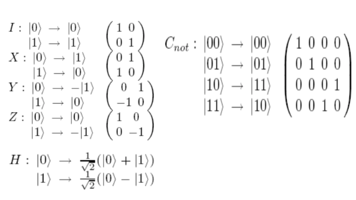
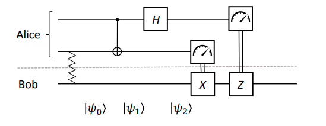
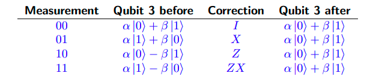

# Week 13, Lecture 1

## Quantum Algorithms

### Qubit
<pre>
A classical bit is an intuitive concept, it is either equal to:
    0 = ⎡1⎤ = |0〉 or 1 = ⎡0⎤ = |1〉
        ⎣0⎦              ⎣1⎦  

Even if we are uncertain about whether a classical bit, B, is in state 0 or 1, we can characterise it by a probability mass function, or a mixture
    p(B = 0) = p0 ; p(B = 1) = p1
where p0 + p1 = 1. 
A qubit, |ψ〉, is quite different, it can be in a superposition of the 0 and 1 states:
    |ψ〉 = α |0〉 + β |1〉
where α and β are complex numbers such that |α|2 + |β|2 = 1.
</pre>

### Measuring a qubit
<pre>
Any attempt to measure the state
    |ψ〉 = α |0〉 + β |1〉
results in |0〉 with probability |α|2, and |1〉 with probability |β|2.
After the measurement, the system is in the measured state! That is, the post-measurement state, |ψ'〉, will be:
    |ψ'〉 = |0〉 or |ψ'〉 = |1〉
Further measurements will always yield the same value. We can only extract one bit of information from the state of a qubit.
</pre>

### No-Cloning Theorem
<pre>
We have a quantum state |ψ〉 and a register initially set to |0〉, and we wish to find a cloning unitary, U such that:
    U (|ψ〉 |0〉) = |ψ〉 |ψ〉
We will now prove that no such U exists.

<b>Proof</b>
Consider that U must clone all quantum states, so along with:
    U (|ψ〉 |0〉) = |ψ〉 |ψ〉
we have:
    U (|φ〉 |0〉) = |φ〉 |φ〉
Taking the inner products of the left- and right-hand sides of the above equations, we get:
    〈0| 〈ψ|U†U |φ〉 |0〉 =(〈ψ| 〈ψ|)(|φ〉 |φ〉)
    ⇒ 〈ψ|φ〉 〈0|0〉 =(〈ψ|φ〉)2
    ⇒ 〈ψ|φ〉 =(〈ψ|φ〉)2
which is only true if ψ = φ or ψ and φ are orthogonal (so their inner-product is 0). 
So we have proven that there exists no unitary U that can clone arbitrary quantum states.
</pre>

### Multiple qubits
<pre>
We saw that a single bit has two possible states, and a qubit state has two complex amplitudes. Similarly, two bits have four possible states.
A basis for a three qubit system is
    {|000›, |001›, |010›, |011›, |100›, |101›, |110›, |111›}
and in general an n qubit system has 2n basis vectors. 
As we can see, the state space grows exponentially with the number of qubits. This is the reason quantum computers with large numbers of qubits are so difficult to simulate.
</pre>

### Quantum Entanglement
<pre>
The state |00› + |11› cannot be described in terms of its qubit states separately.
We cannot find a1, a2, b1, b2 such that 
    (a1|0› + b1|1›) ⊗ (a2|0› + b2|1›) = |00› + |11› =  a1a2|00› + a1b2|01› + b1a2|10› + b1b2|11› 
which means a1b2 = 0 which implies that either a1a2 = 0 or b1b2 = 0. 
States which cannot be decomposed in this way are called entangled states.
</pre>

### Quantum Gates and Circuits
<pre>
Five Simple Quantum Gates and Cnot gate:
</pre>

### Quantum Teleportation
<pre>
Alice and Bob share an entangled pair ((1/√2)(|00› + |11›)) along with a communication channel.
We will now see how they can:
    1. Use the shared entanglement and two bits of classical information to transfer one qubit (teleportation).
    2. Use the shared entanglement and one qubit of quantum information to transfer two classical bits (superdense coding).
</pre>

<pre>
|ψ0› = 1√2(α |0› + β |1›)(|00› + |11›)
     = 1√2(α |0›(|00› + |11›) + β |1›(|00› + |11›))
|ψ1› = 1/2(α |0›(|00› + |11›) + β |1›(|10› + |01›))
|ψ2› = 1/2(α(|0› + |1›)(|00› + |11›) + β(|0› − |1›)(|10› + |01›))
|ψ2› =1/2(|00›(α |0› + β |1›) + |01›(α |1› + β |0›) + |10›(α |0› − β |1›) + |11›(α |1› − β |0›))

Alice now measures her two qubits, and sends the results to Bob, who uses this classical information to apply a correction to his qubit (qubit 3):
</pre>

<pre>
So we can see that, regardless of the measurement outcomes, Alice’s qubit state has now been realised on qubit 3 (i.e., in Bob’s possession).
Note that teleportation does not violate the no-cloning principle, as Alice’s original qubit has been destroyed in the process.
</pre>