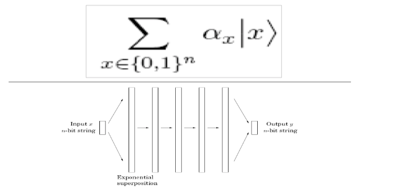
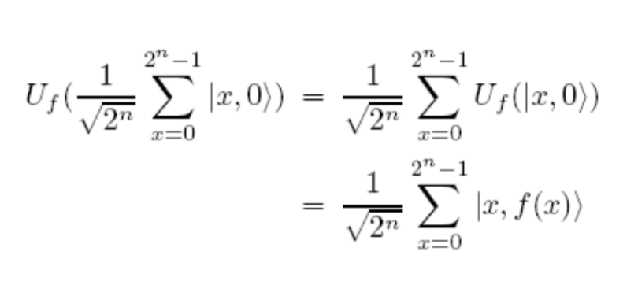
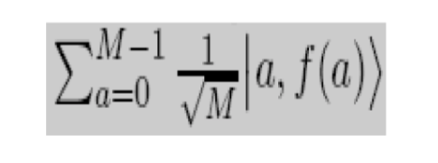
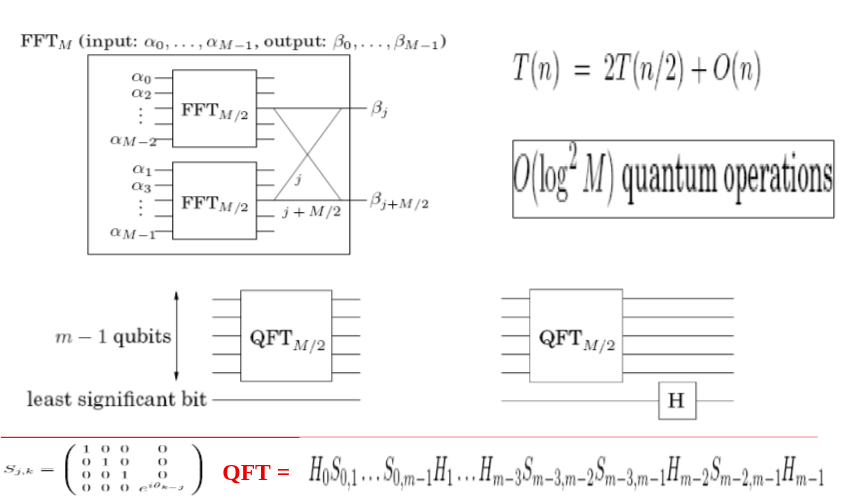
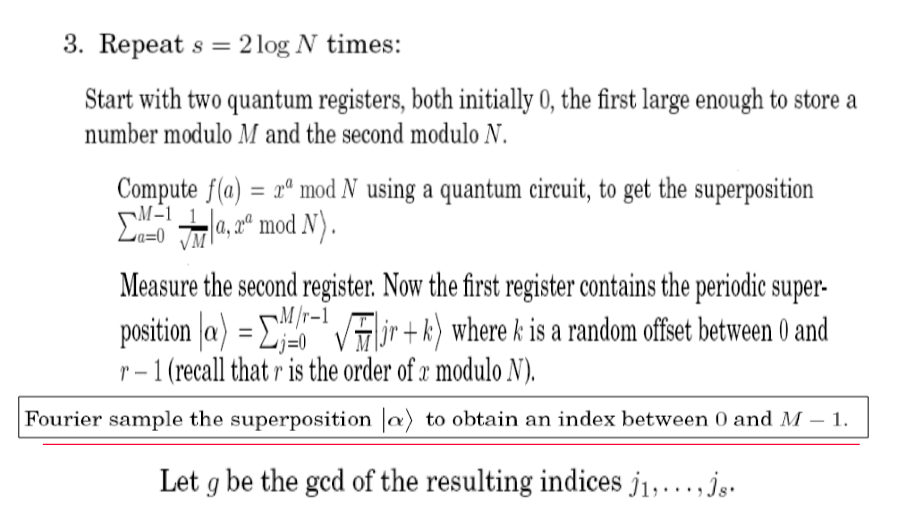

# Week 13, Lecture 2

## Shor's Algorithm
<pre>
Shor’s algorithm is famous for factoring integers in polynomial time.
Since the best-known classical algorithm requires superpolynomial time to factor the product of two primes, the widely used cryptosystem, RSA, relies on factoring being impossible for large enough integers.
</pre>

### Step-1: Factoring is reduced to finding a nontrivial square root of 1 modulo N
<pre>
<b>Lemma</b>: If x is a non-trivial square root of 1 modulo N, then gcd(x+1,N) is a non-trivial factor.
<b>Proof</b>
x2 ≡ 1 mod N implies that N divides x2-1 = (x+1)(x-1)
    x !≡ ±1 mod N
Therefore N must have a nontrivial factor in common with each of (x + 1) and (x - 1).
</pre>

### Step-2: Finding such a root is reduced to computing the order of a random integer modulo N
<pre>
Let r be the smallest positive integer such that xr ≡ 1 mod N.
Select a random x. Assume gcd(x,N) = 1.
If r, the order of x, is even, then a non-trivial square root of 1 is xr/2
</pre>

### Step-3: The order of an integer is precisely the period of a particular periodic superposition
<pre>
    f(a) = xa mod N
If r is the order, then f(0) = f(r) = f(2r) ... = 1
Similarly, f(1) = f(r+1) = f(2r+1) .... = x.
Hence, f is periodic with period r.

<b>Massive Paralellism</b>
n qubits = superposition of their 2n possible states.
In the below picture, the middle steps are all unitary transformations.
</pre>

<pre>
<b>Quantum Paralellism</b>
By linearity,
</pre>

<pre>
<b>Setting up the periodic superposition</b>
Compute with UF where f(a) = xa mod N.
Measure the second register. This gives a periodic superposition on the first register, with period r, the period of f.
The state after this measurement clearly shows the periodicity of f.
</pre>

### Step-4: Periods of superpositions can be efficiently found by the quantum FFT

### Code
<pre>
Input: Odd composite integer N
Output: a factor of N

1. Choose x uniformly at random in the range 1 <= x <= N-1.
2. Let M be a power of 2 close to N.
</pre>

<pre>
4. If M/g is even, then compute gcd(N,xM/2g+1) and give it as the output if it's a non-trivial factor of n; else return to step 1.
</pre>