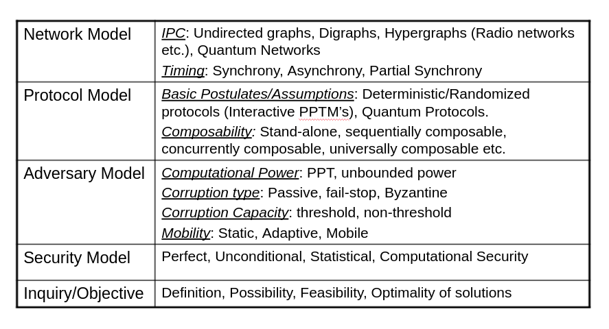
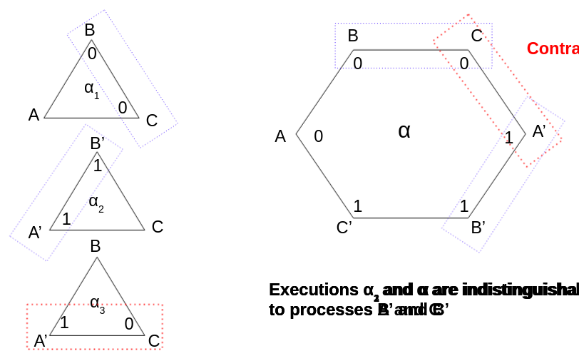
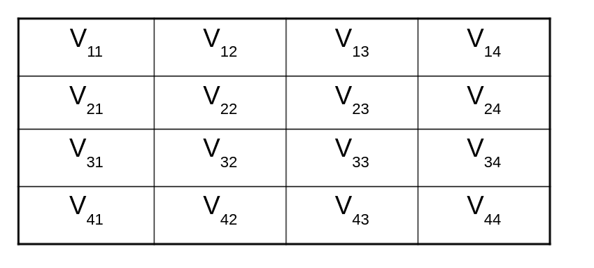

# Week 14, Lecture 2

## Byzantine Agreement
<pre>
Each process starts with an input from a fixed set V = {0,1}. 
The goal is for the players to eventually produce decisions from the set V while maintaining the following conditions, even in the presence of an enemy who can Byzantinely corrupt up to any t of the n players:
    - <b>Agreement</b> -  All non faulty processes decide on the same value u ∈ V.
    - <b>Validity</b> -  If all non-faulty processes start with the same initial value u ∈ V, then u = v.
    - <b>Termination</b> - All non faulty processes eventually decide.
</pre>

### Various models 

### Impossibility for 1 out of 3
<pre>
Executions α3 and α are indistinguishable to processes A’ and C.
</pre>
 

### Protocol for 1 out of 4
<pre>
The technique involves the exchange of messages, followed by the computation of an interactive consistency vector based on the results of the exchange.
Two rounds of information exchange is necessary:
    - In the first round the processors exchange their input values.
    - In the second round they exchange all the values obtained in the first round.
</pre>

### Authenticated Byzantine Agreement (ABA)
<pre>
- Processes are supplemented with special powers to authenticate their communication.
- Using authentication, fault tolerance can be increased to t < n. 
</pre>

### The Message Matrix
<pre>
- Vij is the message that player i receives from player j.
- The message matrices differ by no more than one row and corresponding column between the players.
</pre>

### ABA protocol for 1 out of 3
<pre>
PLayer k stores a set Wik, ∀ i ∈ P.
Initially Wkk = {σ} where σ is player k’s input value.
Repeat these steps on the received value for two rounds after receiving values from neighbors:
    - Append the message's content to the set Wik if it is correctly signed.
    - Send i, Wik to your neighbors.

Delete Wik if |Wik| != 1.
As all of the remaining Wiks are singletons, you has majority over all values. If a majority exists, you decide on it; else choose the default value.
</pre>

### Connectivity Challenge
<pre>
In a synchronous P2P network of n nodes, t of which are Byzantine faulty, consensus is possible only if the network is (2t + 1)-connected.
(t + 1)-connectivity is sufficient with cryptography.
</pre>

### Round-Complexity Challenge
<pre>
In a synchronous P2P network of n nodes, t of which are Byzantine faulty, consensus requires > t rounds in the worst case.
</pre>