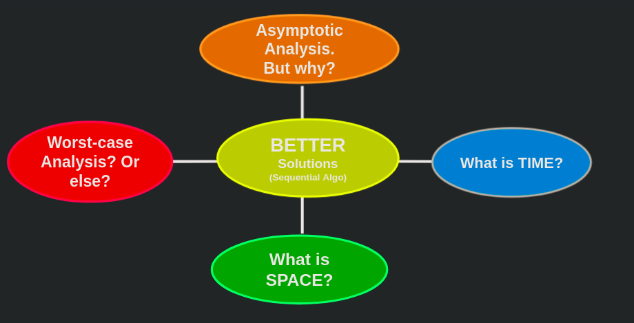

# Week 1, Lecture 1

## Problems

Problems can be assumed as membership queries in languages.

### Decision Problems

- Output is a single bit (true or false)
- Each decision problem is characterized by a subset of the set of all possible inputs (that is, subset of, say, {0,1}*) or languages eg: INPUT: String x ; OUTPUT: YES if x in language L, else NO
  
Example 1: Primality Testing
PRIMES = {n | n is prime}

Example 2 : Graph Connectivity
GC = {Graph G | G is connected}

Example 3 : Boolean Satisfiability 
SAT = {CNF Boolean formula f | f is not a fallacy; i.e. f is satisfiable}

## Axioms of Computation

- It takes non-zero time to retrieve data from far-off locations 
  - Machines Are Not Omnipresent
  
- Only finite information can be stored/retrieved from finite volume
  - Machines Are Not Omniscient

- A finite length code only exerts finite amount of control
  - Machines Are Not Omnipotent

## How to COMPARE various Solutions?

