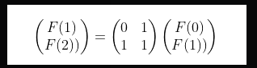
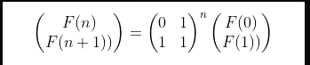
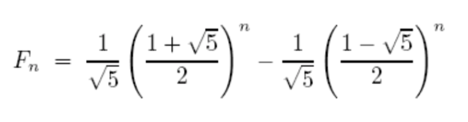

# Week 2, Lecture 1

Whenever we have an algorithm, there are three questions we always ask about it:
1. Is it correct?
2. How much time does it take, as a function of n?
3. And can we do better?

## Fibonacci Series

The fibonacci series is a sequence of numbers each the sum of its two immediate predecessors.
0, 1, 1, 2, 3, 5, 8, 13, 21 .... so on.

Formally, the n <sup>th</sup> fibonacci number in the sequence (f <sub>n </sub>) is given by:
- F <sub>n </sub> = F<sub> n-1 </sub> + F <sub> n-2 </sub> if n > 1
- F <sub>n </sub> = 1               if n = 1 
- F <sub>n </sub> = 0               if n = 0 

### Algorithm 1 to calculate F <sub>n</sub>

This algorithm recursively calculates F <sub>n</sub>:

```python 
function fib1(n)
if n = 0: return 0
if n = 1: return 1
return fib1(n − 1) + fib1(n − 2)
```

#### Analysis:

For larger values of n, there are two recursive invocations of fib1, taking time
T(n − 1) and T(n − 2), respectively, plus three computer steps (checks on the value
of n and a final addition). Therfore, the recurrence relation comes out to be:

T(n) = T(n − 1) + T(n − 2) + 3 for n > 1

We see that T(n) ≥ F<sub>n</sub>. This implies that the running time of the algorithm grows as fast as the
Fibonacci numbers! T(n) is exponential in n, which implies that the algorithm is
impractically slow except for very small values of n.
So this naive algorithm is correct but inefficient in time complexity.

### Algorithm 2 to calculate F <sub>n</sub>

fib1 was inefficient because many computations are repeated in the recursive calls. 
A more sensible scheme would store the intermediate results—the values F <sub>0</sub> , F <sub>1</sub> , . . . ,F <sub>n-1</sub> as soon as they become known. 
fib2 does the same:

```python
function fib2(n)
if n = 0: return 0
create an array f[0 . . . n]
f[0] = 0, f[1] = 1
for i = 2 . . . n:
f[i] = f[i − 1] + f[i − 2]
return f[n]
```

#### Analysis:

The time complexity appears to be linear but it is not for larger values of n.
It is reasonable to treat addition as a single computer step if small numbers are being added, 32-bit numbers say. But the nth Fibonacci number is about 0.694n bits long, and this can far exceed 32 as n grows.
Given that the addition of two n-bit numbers takes time roughly proportional to n, the time complexity of fib2 is proportional to n<sup>2</sup>.

### Algorithm 3 to calculate F <sub>n</sub>

We use matrix multiplication to calculate F <sub>n</sub>. We express each F <sub>i</sub> in the form of a 2*2 matrix.
As in,





#### Analysis:

We observe that we can reach F <sub>n</sub> by multiplying the initial matrix by 2 for log(n) times. Also, multiplication involves n-bit integers. Therefore, if we assume the time complexity of multiplication is M(n), the total time complexity of fib3 is O(M(n)*log(n)).

### Algorithm 4 to calculate F <sub>n</sub>

We can use the direct formula for F <sub>n</sub>:



#### Analysis:

We observe that we can reach F <sub>n</sub> by multiplying the irrational number by 2 for log(n) times. Also, multiplication involves n-bit irrationals. Therefore, if we assume the time complexity of multiplication is M(n), the total time complexity of fib3 is O(M(n)*log(n)). But this method is not preferred because multiplication of irrationals to higher powers might cause accuracy deficits.

## Karatsuba algorithm for multiplication of two large numbers

We use divide and conquer approach. Suppose x and y are two n-bit integers. As a first step
toward multiplying x and y, split each of them into their left and right halves, which are n/2 bits long:

x = 2<sup>n/2</sup>x<sub>L</sub> + x<sub>R</sub>
y = 2<sup>n/2</sup>y<sub>L</sub> + y<sub>R</sub>

xy = (2<sup>n/2</sup>x<sub>L</sub> + x<sub>R</sub>)(2<sup>n/2</sup>y<sub>L</sub> + y<sub>R</sub>)
   = 2<sup>n</sup>x<sub>L</sub>y<sub>L</sub> + 2<sup>n/2</sup>((x<sub>L</sub> + x<sub>R</sub>)(y<sub>L</sub> + y<sub>R</sub>) - x<sub>L</sub>y<sub>L</sub> - x<sub>R</sub>y<sub>R</sub>) + x<sub>R</sub>y<sub>R</sub>

```python
function multiply(x, y)
Input: n-bit positive integers x and y
Output: Their product
if n = 1: return xy
x L , x R = leftmost ceil(n/2), rightmost floor(n/2) bits of x
y L , y R = leftmost ceil(n/2), rightmost floor(n/2) bits of y
P 1 = multiply(x L , y L )
P 2 = multiply(x R , y R )
P 3 = multiply(x L + x R , y L + y R )
return P 1 × 2^(n) + (P 3 − P 1 − P 2 ) × 2^(n/2) + P 2
```

#### Analysis:

The recurrence relation for the above algorithm is:

T(n) = 3T(n/2) + O(n)

The total time complexity comes out to be O(n<sup>1.59</sup>).
