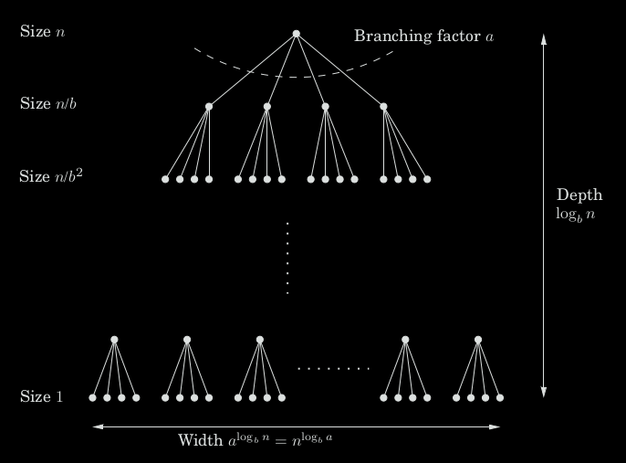
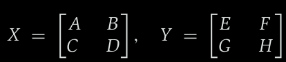
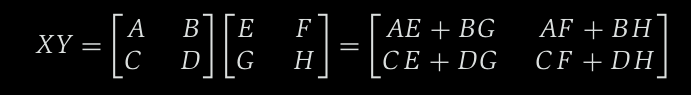
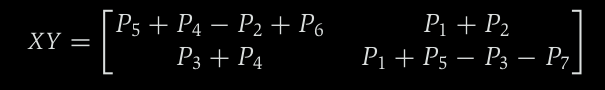

# Week 2, Lecture 2

## Recurrence Relations (Master Theorem)

Divide-and-conquer algorithms often follow a generic pattern: they tackle a problem of size n by recursively solving, say, a subproblems of size n/b and then combining these answers in O(n<sup>d</sup>) time, for some a, b, d > 0 
(in the multiplication algorithm, a = 3, b = 2, and d = 1).
Therefore, their running time comes out to be:

T(n) = aT(ceil(n/b)) + O(n<sup>d</sup>)

The Master Theorem states that time complexity of the above recurrence relation is:

T(n) = O(n<sup>d</sup>)                 if d > log<sub>b</sub>a

T(n) = O(n<sup>d</sup>log(n))           if d = log<sub>b</sub>a

T(n) = O(n<sup>log<sub>b</sub>a</sup>)  if d < log<sub>b</sub>a

#### Analysis:



Notice that the size of the subproblems decreases by a factor of b with each level of recursion, and therefore reaches the base case after log<sub>b</sub>n levels. This is the height of the recursion tree. Its branching factor is a, so the kth level of the tree is made up of a k subproblems, each of size n/b<sup>k</sup>. The total work done at this level is:

a<sup>k</sup> * O(n/b<sup>k</sup>)<sup>d</sup> = O(n<sup>d</sup>) * (a/b<sup>d</sup>)<sup>k</sup>

As k goes from 0 (the root) to log<sub>b</sub>n (the leaves), these numbers form a geometric series with ratio a/b<sup>d</sup>. After we find the sum of this series, we get three cases:

1. The ratio is less than 1.
   Then the series is decreasing, and its sum is just given by its first term, O(n<sup>d</sup>). 
2. The ratio is greater than 1.
   The series is increasing and its sum is given by its last term, O(n<sup>log<sub>b</sub>a</sup>):

   n<sup>d</sup> * (a/b<sup>d</sup>)<sup>log<sub>b</sub>n</sup> =  n<sup>d</sup> * (a<sup>log<sub>b</sub>n</sup>)/(b<sup>log<sub>b</sub>n</sup>)<sup>d</sup> = a<sup>log<sub>b</sub>n</sup> = a<sup>(log<sub>a</sub>n)(log<sub>b</sub>a)</sup> = n<sup>log<sub>b</sub>a</sup>
3. The ratio is exactly 1.
   In this case all O(log(n)) terms of the series are equal to O(n<sup>d</sup>).   

These cases translate directly into the three contingencies in the Master Theorem.

### Binary Search

The ultimate divide-and-conquer algorithm is, of course, binary search: to find a key k in a large file containing keys z[0, 1, . . . , n − 1] in sorted order, we first compare k with z[n/2], and depending on the result we recurse either on the first half of the file, z[0, . . . , n/2 − 1], or on the second half, z[n/2, . . . , n − 1]. The recurrence now is T(n) = T(ceil(n/2)) + O(1), which is the case a = 1, b = 2, d = 0. Plugging into our master theorem we get the familiar solution: a running time of just O(log(n)).

## Merge Sort

The problem of sorting a list of numbers lends itself immediately to a divide-and-
conquer strategy: split the list into two halves, recursively sort each half, and then
merge the two sorted sublists.

```python
function mergesort(a[1 . . . n])
Input: An array of numbers a[1 . . . n]
Output: A sorted version of this array
if n > 1:
return merge(mergesort(a[1 . . . floor(n/2)]),
mergesort(a[floor(n/2) + 1 . . . n]))
else:
return a
```

```python
function merge(x[1 . . . k], y[1 . . . l])
if k = 0: return y[1 . . . l]
if l = 0: return x[1 . . . k]
if x[1] ≤ y[1]:
return x[1] ◦ merge(x[2 . . . k], y[1 . . . l])
else:
return y[1] ◦ merge(x[1 . . . k], y[2 . . . l])
```

Here ◦ denotes concatenation. This merge procedure does a constant amount of work per recursive call (provided the required array space is allocated in advance), for a total running time of O(k + l). Thus merge’s are linear, and the recurrence relation of this mergesort is:

T(n) = 2T(n/2) + O(n)

whose time complexity comes out to be O(nlog(n)). (From Master theorem)

### Iterative merge sort:

At any given moment, there is a set of “active” arrays; initially, the singletons; which are merged in pairs to give the next batch of active arrays. These arrays can be organized in a queue, and processed by repeatedly removing two arrays from the front of the queue, merging them, and putting the result at the end of the queue.

```python
function iterative-mergesort(a[1 . . . n])
Input: elements a 1 , a 2 , . . . , a n to be sorted
Q = [ ] (empty queue)
for i = 1 to n:
inject(Q, [a i ])
while |Q| > 1:
inject(Q, merge(eject(Q), eject(Q)))
return eject(Q)
```

The inject operation adds an element to the end of the queue while eject removes and returns the element at the front of the queue.

## Matrix multiplication

Consider two (n × n) matrices X and Y.
Matrix multiplication is particularly easy to break into subproblems, because it can be performed blockwise, i.e carve X into four n/2 × n/2 blocks, and also Y:



Now, their product can be expressed in terms of these blocks and is exactly as if the blocks were single elements:



We now have a divide-and-conquer strategy: to compute the size-n product XY, recursively compute eight size-n/2 products AE , B G , AF , B H, C E , DG , C F , D H , and then do a few O(n 2 )-time additions. The total running time is described by the recurrence relation:

T(n) = 8T(n/2) + O(n<sup>2</sup>)

But this comes out to be O(n<sup>3</sup>) which is inefficient. 
There's a better way to compute XY, XY can be computed from just seven n/2 × n/2 subproblems by a tricky decomposition - **Strassen's algorithm**.



where,

P<sub>1</sub> = A(F − H)          

P<sub>2</sub> = (A + B)H             

P<sub>3</sub> = (C + D)E             

P<sub>4</sub> = D(G − E)

P<sub>5</sub> = (A + D)(E + H)

P<sub>6</sub> = (B − D)(G + H)

P<sub>7</sub> = (A − C)(E + F)

The new running time is:

T(n) = 7T(n/2) + O(n<sup>2</sup>),

which by the master theorem comes out to be O(n<sup>log<sub>2</sub>7</sup>) ~ O(n<sup>2.81</sup>)

## Median

Using merge sort, we can find the median of a given list of numbers in O(nlog(n)).

But there exists a better approach whose time complexity is O(n).
For any number v, imagine splitting list S into three categories: elements smaller than v, those equal to v (there
might be duplicates), and those greater than v. Call these S<sub>L</sub>, S<sub>v</sub> and S<sub>R</sub> respectively.

selection(S, k) = selection(S<sub>L</sub>, k)                   if k ≤ |S<sub>L</sub>|
selection(S, k) = v                                    if |S<sub>L</sub>| < k ≤ |S<sub>L</sub>| + |S<sub>v</sub>|
selection(S, k) = selection(S<sub>R</sub>, k − |S<sub>L</sub>| − |S<sub>v</sub>|) if k > |S<sub>L</sub>| + |S<sub>v</sub>|.

The effect of the split is to shrink the number of elements from |S| to at most max{|S|<sub>L</sub>, |S<sub>R</sub>|}.
We now pick v randomly from S.
The running time of our algorithm depends on the random choices of v. It is possible that due to persistent bad luck we keep picking v to be the largest element of the array (or the smallest element), and thereby shrink the array by only one element each time. This worst-case scenario would force our selection algorithm to
perform O(n<sup>2</sup>) operations, but it is extremely unlikely to occur. Equally unlikely is the best possible case in which each randomly chosen v just happens to split the array perfectly in half, resulting in a running
time of O(n).

To distinguish between lucky and unlucky choices of v, we will call v good if it lies within the 25th to 75th percentile of the array that it is chosen from. We like these choices of v because they ensure that the sublists S<sub>L</sub> and S<sub>R</sub> have size at most three-fourths that of S, so that the array shrinks substantially.

Therefore, after two split operations on average, the array will shrink to at most three-fourths of its size. Letting T(n) be the expected running time on an array of size n, we get:

T(n) ≤ T(3n/4) + O(n)

From this recurrence relation, we get the time complexity to be O(n). (from master theorem)
