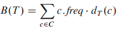
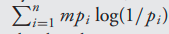
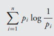

# Week 4, Lecture 2

## Activity Selection

<pre>
Suppose we have a set S = {a<sub>1</sub>, a<sub>2</sub>, ...., a<sub>n</sub>} of n proposed activities that wish to use a resource, such as a lecture hall, which can serve only one activity at a time.
Each activity a<sub>i</sub> has a start time s<sub>i</sub> and a finish time f<sub>i</sub> , where 0  s<sub>i</sub> < f<sub>i</sub> < 1. If selected, activity a<sub>i</sub> takes place during the half-open time interval [s<sub>i</sub>, f<sub>i</sub>). Activities a<sub>i</sub> and a<sub>j</sub> are compatible if the intervals [s<sub>i</sub>, f<sub>i</sub>) and [s<sub>j</sub>, f<sub>j</sub>) do not overlap. That is, a<sub>i</sub> and a<sub>j</sub> are compatible if s<sub>i</sub> >= f<sub>j</sub> or s<sub>j</sub> >= f<sub>i</sub>.
In the activity-selection problem, we wish to select a maximum-size subset of mutually compatible activities.
We assume that the activities are sorted in monotonically increasing order of finish time:

f<sub>1</sub> <= f<sub>2</sub> <= f<sub>3</sub> .... <= f<sub>n-1</sub> <= f<sub>n</sub> 
</pre>

### Optimal Substructure Property:
<pre>
We now verify that the activity-selection problem exhibits optimal substructure. Let us denote by S<sub>ij</sub> the set of activities that start after activity a<sub>i</sub> finishes and that finish before activity a<sub>j</sub> starts.
Suppose that we wish to find a maximum set of mutually compatible activities in S<sub>ij</sub> , and suppose further that such a maximum set is A<sub>ij</sub> , which includes some activity a<sub>k</sub>.
By including a<sub>k</sub> in an optimal solution, we are left with two subproblems: finding mutually compatible activities in the set S<sub>ik</sub> and finding mutually compatible activities in the set S<sub>kj</sub>.
Therefore, the activity-selection problem exhibits optimal substructure property.
</pre>
### Greedy Choice:

Consider any nonempty subproblem S<sub>k</sub>, and let a<sub>m</sub> be an activity in S<sub>k</sub> with the earliest finish time. Then a<sub>m</sub> is included in some maximum-size subset of mutually compatible activities of S<sub>k</sub>.

#### Proof:
<pre>
Let A<sub>k</sub> be a maximum-size subset of mutually compatible activities in S<sub>k</sub>,
and let a<sub>j</sub> be the activity in A<sub>k</sub> with the earliest finish time.
If a<sub>j</sub> = a<sub>m</sub>, we are done, since we have shown that a<sub>m</sub> is in some maximum-size subset of mutually compatible activities of S<sub>k</sub>. If aj != am, let the set A'<sub>k</sub> = Ak - {a<sub>j</sub>} U {a<sub>m</sub>} be A<sub>k</sub> but substituting a<sub>m</sub> for a<sub>j</sub>.
The activities in A'<sub>k</sub> are disjoint, which follows because the activities in A<sub>k</sub> are disjoint, a<sub>j</sub> is the first activity in A<sub>k</sub> to finish, and f<sub>m</sub> <= f<sub>j</sub>.
Since |A'<sub>k</sub>| = |A<sub>k</sub>|, we conclude that A'<sub>k</sub> is a maximum-size subset of mutually compatible activities of S<sub>k</sub>, and it includes a<sub>m</sub>.
</pre>

### Greedy Algorithm:
<pre>
The recursive procedure takes the start and finish times of the activities, represented as arrays s and f, the index k that defines the subproblem S<sub>k</sub> it is to solve, and the size n of the original problem.
It returns a maximum-size set of mutually compatible activities in S<sub>k</sub>. We assume that the n input activities are already ordered by monotonically increasing finish time. If not, we can sort them into this order in O(nlog(n)) time, breaking ties arbitrarily.
In order to start, we add the fictitious activity a<sub>0</sub> with f<sub>0</sub> = 0, so that subproblem S<sub>o</sub> is the entire set of activities S.
</pre>
```python
RECURSIVE-ACTIVITY-SELECTOR(s, f, k, n)
m = k + 1
2 while m <= n and s[m] < f [k]: 
3   m = m + 1
4 if m <= n:
5   return {a_m} U RECURSIVE-ACTIVITY-SELECTOR(s, f, m, n)
6 else: 
    return NULL_SET
```
Assuming that the activities have already been sorted by finish times, the running time of the call RECURSIVE-ACTIVITY-SELECTOR(s, f, 0, n) is O(n). 

The procedure GREEDY-ACTIVITY-SELECTOR is an iterative version of the procedure RECURSIVE-ACTIVITY-SELECTOR. It also assumes that the input activities are ordered by monotonically increasing finish time. It collects selected activities into a set A and returns this set when it is done.

```python
GREEDY-ACTIVITY-SELECTOR(s, f)
n = s.length
A = {a_1}
k = 1
for m = 2 to n:
  if s[m] >= f [k]:
    A = A U {a_m}
    k = m
return A
```
Like the recursive version, GREEDY-ACTIVITY-SELECTOR schedules a set of n activities in O(n) time, assuming that the activities were already sorted initially by their finish times.

## Huffman Codes
<pre>
We consider the data to be a sequence of characters. Huffman’s greedy algorithm uses a table giving how often each character occurs (frequency) to build up an optimal way of representing each character as a binary string.
We consider the problem of designing a binary character code in which each character is represented by a unique binary string, which we call a codeword. If we use a fixed-length code, we need 3 bits to represent 6 characters: a = 000, b = 001, ..., f = 101. But this way of coding is inefficient.
A variable-length code can do considerably better than a fixed-length code, by giving frequent characters short codewords and infrequent characters long codewords.
</pre>

### Prefix Codes:
<pre>
Codes in which no codeword is a prefix of some other codeword are called prefix codes. A prefix code can always achieve the optimal data compression among any character code.
Prefix codes are desirable because they simplify decoding. Since no codeword is a prefix of any other, the codeword that begins an encoded file is unambiguous. We can simply identify the initial codeword, translate it back to the original character, and repeat the decoding process on the remainder of the encoded file. 
For example, the string 001011101 parses uniquely as 0  0  101  1101, which decodes to aabe.

An optimal code for a file is always represented by a full binary tree, in which every nonleaf node has two children.
We can say that if C is the alphabet from which the characters are drawn and all character frequencies are positive, then the tree for an optimal prefix code has exactly |C| leaves, one for each letter of the alphabet, and exactly |C| - 1 internal nodes.
Given a tree T corresponding to a prefix code, we can compute the number of bits required to encode a file:
For each character c in the alphabet C, let the attribute c.freq denote the frequency of c in the file and let d<sub>T</sub>(c) denote the depth of c’s leaf in the tree. d<sub>T</sub>(c) is also the length of the codeword for character c. 
Hence, the number of bits required to encode a file is:
</pre>


which is the cost of tree T.

### Huffman Algorithm:
<pre>
We assume that C is a set of n characters and that each character c ∈ C is an object with an attribute c.freq giving its frequency.
The algorithm builds the tree T corresponding to the optimal code in a bottom-up manner. It begins with a set of |C| leaves and performs a sequence of |C| - 1 'merging' operations to create the final tree. 
The algorithm uses a min-priority queue Q, keyed on the freq attribute, to identify the two least-frequent objects to merge together. When we merge two objects, the result is a new object whose frequency is the sum of the frequencies of the two objects that were merged.
</pre>
```python
HUFFMAN(C)
1 n = |C|
2 Q = C
3 for i = 1 to n - 1:
4   allocate a new node z
5   z.left = x = EXTRACT-MIN(Q)
6   z.right = y = EXTRACT-MIN(Q)
7   z.freq = x.freq + y.freq
8   INSERT(Q,z)
9 return EXTRACT-MIN(Q) 
```

#### Time complexity:
<pre>
We assume that Q is implemented as a binary min-heap.
For a set C of n characters, we can initialize Q in line 2 in O(n) time using the BUILD-MIN-HEAP procedure. The for loop in lines 3–8 executes exactly n - 1 times, and since each heap operation requires time O(log(n)), the loop contributes O(nlog(n)) to the running time. 
Thus, the total running time of HUFFMAN on a set of n characters is O(nlog(n)). 
</pre>

- Note - The problem of determining an optimal prefix code exhibits the greedy-choice and optimal substructure properties.

### Entropy:
<pre>
The inherent unpredictability of a probability distribution can be measured by the extent to which it is possible to compress data drawn from that distribution.

          more compressible ≡ less random ≡ more predictable

Suppose there are n possible outcomes, with probabilities p<sub>1</sub>, p<sub>2</sub>,..., p<sub>n</sub>. If a sequence of m values is drawn from the distribution, then the i<sup>th</sup> outcome will pop up approximately
m<sub>p</sub>i times (when m is large).
Assume that the p<sub>i</sub>’s are of the form 1/2<sup>k</sup>
By induction, the number of bits needed to encode the sequence is:
</pre>

Thus the average number of bits needed to encode a single draw from the distribution is:


This is the entropy of the distribution - a measure of how much randomness it contains.
