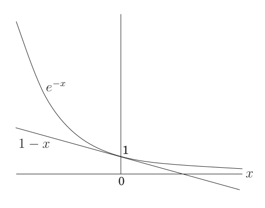

# Week 5, Lecture 1

## Set Cover
<pre>
Input: A set of elements B; sets S1 , . . . , Sm ⊆ B
Output: A selection of the Si whose union is B.
Cost: Number of sets picked.

We need to make the selection such that the cost is minimum.
We can do this greedily:

Repeat until all elements of B are covered:
    Pick the set Si with the largest number of uncovered elements

For example,
Let 
Set to cover B = {1,2,3,4,5,6}
Set Family = {1,2,3,4}, {1,3,5}, {2,4,6}

According to the greedy approach, {1,2,3,4} is picked first as it has the largest number of uncovered elements. Then the remaining two sets are picked in order to cover elements 5 and 6. So, the greedy approach picked all three sets.
But the optimal solution is picking just two sets: {1,3,5} and {2,4,6}
Hence, we notice that the greedy solution is not always optimal.
</pre>
- Note -  Set Cover is NP complete.

### Approximation:

**Suppose B contains n elements and that the optimal cover consists of k sets.
Then the greedy algorithm will use at most k ln(n) [^1] sets.**

#### Proof:
<pre>
Let nt be the number of elements still not covered after t iterations of the greedy
algorithm. Since these remaining elements are covered by the optimal k sets, there must be some set with at least nt/k of them. Therefore, according to the greedy approach:

nt+1 <= nt - nt/k = nt(1-1/k),

which by repeated application gives: nt <= n0(1-1/k)t
We now use the inequality: 
1-x <= e-x, with equality if and only if x = 0
This can be observed from their graphs:
</pre>

<pre>
Thus, using the above inequality, we get:

nt <= n0(1-1/k)t 

==> nt < n0(e-1/k)t

==> nt < ne-t/k (as n0 = n)

At t = k ln(n), we see nt is strictly less than ne-ln(n) = 1, which means no elements
remain to be covered.
Therefore, the time complexity of this approximate greedy algorithm comes out to be O(ln(n)).
</pre>
[^1]: ln(n) = loge(n)
