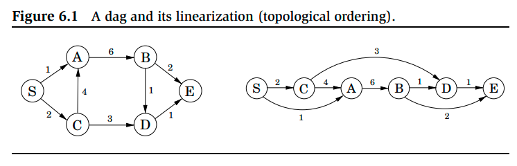
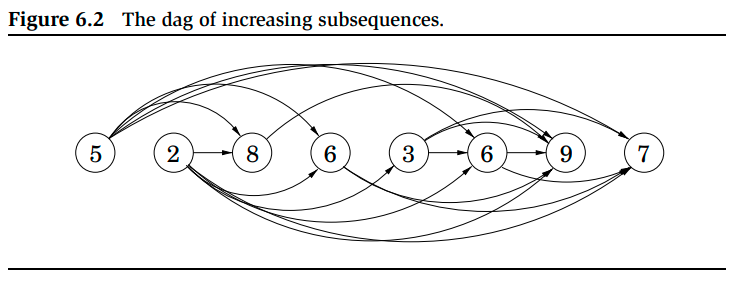

# Week 5, Lecture 2

## Shortest Path in DAGs

The special feature of a DAG is that its nodes can be linearized; that is, they can be arranged on a line so that all edges go from left to right. (topological sort)


<pre>
Suppose we want to calculate distance of shortest path from node S to node D. The only way to get to D is through its predecessors, B or C ; so to find the shortest path to D, we need only compare these two routes:
          dist(D) = min{dist(B) + 1, dist(C ) + 3}
A similar relation can be written for every node. If we compute these dist values in the left-to-right order, we can always be sure that by the time we get to a node v, we already have all the information we need to compute dist(v). Therefore, we can compute all distances in a single pass.
</pre>
```python
initialize all dist(·) values to ∞
dist(s) = 0
for each v ∈ V\{s}, in linearized order:
  dist(v) = min[(u,v) ∈ E]{dist(u) + l(u, v)}
```
<pre>
The above algorithm is solving a collection of subproblems, {dist(u) : u ∈ V}.
We start with the smallest of them, dist(s), since we immediately know its answer to be 0. We then proceed with progressively “larger” subproblems, distances to vertices that are further and further along in the linearization, where we are thinking of a subproblem as large if we need to have solved a lot of other subproblems before we can get to it.
At each node, we compute some function of the values of the node’s predecessors. It so happens that our particular function is a minimum of sums, but we could just as well make it a maximum, in which case we would get longest paths in the DAG.
Note: In case of cyclic graphs, the attempt to calculate longest paths ends in an infinite loop due to the cycle edges. (As we repeatedly travel through the cycle edges) 
</pre>
This process of computation is called **Dynamic Programming**.
<pre>
In dynamic programming, a problem is solved by identifying a collection of subproblems and tackling them one by one, smallest first, using the answers to small problems to help figure out larger ones, until all of them are solved.
</pre>

## Longest Increasing Subsequences
<pre>
In the longest increasing subsequence problem, the input is a sequence of numbers a<sub>1</sub>,..., a<sub>n</sub>.
A subsequence is any subset of these numbers taken in order, of the form
a<sub>i<sub>1</sub></sub> , a<sub>i<sub>2</sub></sub> ,..., a<sub>i<sub>k</sub></sub> where 1 ≤ i<sub>1</sub> < i<sub>2</sub> < ··· < i<sub>k</sub> ≤ n, and an increasing subsequence is one in which the numbers are getting strictly larger. The task is to find the increasing subsequence of greatest length.
</pre>

<pre>
In this example, we have created a graph of all permissible transitions: establish a node i for each element a<sub>i</sub>, and add directed edges (i, j) whenever it is possible for a<sub>i</sub> and a<sub>j</sub> to be consecutive elements in an increasing subsequence. (whenever i < j and ai < aj)
This graph G = (V, E ) is a DAG:, since all edges (i, j) have i < j, and there is a one-to-one correspondence between increasing subsequences and paths in this DAG:. Therefore, our goal is simply to find the longest path in the DAG:
</pre>
```python
for j = 1, 2,..., n:
  L(j) = 1 + max{L(i):(i, j) ∈ E }
return max_j L(j)
```
<pre>
L(j) is the length of the longest path ending at j (plus 1 since we need to count nodes on the path). We know that any path to node j must pass through one of its predecessors, and therefore L(j) is 1 plus the maximum L(·) value of these predecessors. Hence, the final answer is the largest L(j), since any ending position is allowed.
</pre>
### Time Complexity:
<pre>
In our case, each subproblem is solved using the relation:
     L(j) = 1 + max{L(i):(i, j) ∈ E },
an expression which involves only smaller subproblems.  
It requires the predecessors of j to be known; for this the adjacency list of the reverse graph G<sup>R</sup>, constructible in linear time, is precomputed.
The computation of L(j) then takes time proportional to the indegree of j, giving an overall running time linear in |E|. This is at most O(n<sup>2</sup>), the maximum being when the input array is sorted in increasing order.    
</pre>
**Note** 
<pre>
The L-values only tell us the length of the optimal subsequence.
In order to recover the subsequence itself, we should also note down prev(j), the next-to-last node on the longest path to j, while computing L(j). The optimal subsequence can then be reconstructed by following these backpointers.
</pre>