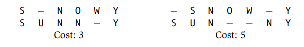
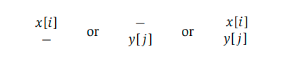
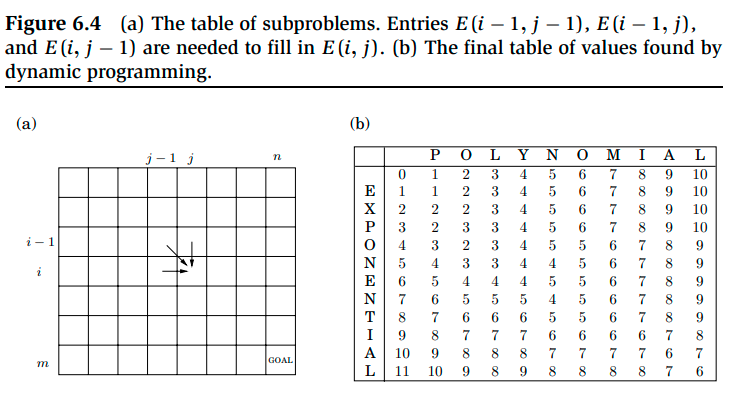
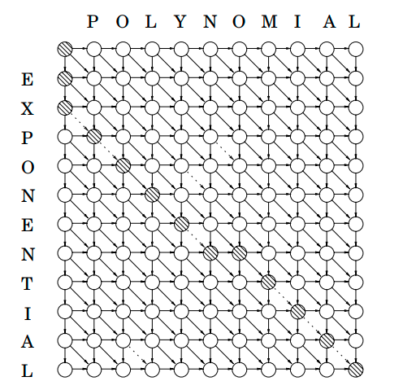

# Week 6, Lecture 1

## Edit Distance
<pre>
A natural measure of the distance between two strings is the extent to which they can be aligned, or matched up. Technically, an alignment is simply a way of writing the strings one above the other. For instance, here are two possible alignments of SNOWY and SUNNY:
</pre>

<pre>
The “−” indicates a “gap”; and there can be any number of gaps in either string. The number of columns in which the letters differ determines the cost of an alignment. And the cost of the best possible alignment between two strings is the edit distance between them. We can see that the alignment of SNOWY and SUNNY indicated above with a cost of 3 is the best.
In general, there are so many alternative alignments between two strings that searching through them all for the optimum one would be inefficient. Rather, we use dynamic programming.
</pre>
<pre>
The most important question to ask while using dynamic programming to solve a problem is, "What are the subproblems?". Our objective is to calculate the edit distance between two strings, x[1...m] and y[1...n].
What is an example of an excellent subproblem? So, instead of looking at the edit distance between some prefix of the first string, x[1...i] and some prefix of the second string, y[1...j], how about looking at the edit distance between some prefix of the second string, y[1 j]? E(i, j) is the name of the subproblem. As a result, our end goal is to compute E(m, n).
We need to express E(i, j) in terms of smaller subproblems. The best alignment between x[1 ··· i] and y[1 ··· j] has its rightmost column as one of these three things:
</pre>

<pre>
The first case has a cost of 1 for this column, and it is still necessary to align x[1....i-1] with y[1...j]. However, this is precisely the subproblem E(i-1, j). We still need to align x[1..i] with y[1...j-1] in the second scenario, which still has cost 1 - E(i, j-1). This is still another subproblem. The subproblem E(i-1, j-1) remains in the final case, which either costs 1 (if x[i] = y[j]) or 0 (if x[i] = y[j]).
In short, E(i, j) has been decomposed into three smaller subproblems: E(i − 1, j), E(i, j − 1), E(i − 1, j − 1). We must choose the best of them:
    E(i, j) = min{1 + E(i − 1, j), 1 + E(i, j − 1), diff(i, j) + E(i − 1, j − 1)}
where diff(i, j) is defined to be 0 if x[i] = y[j] and 1 otherwise.
</pre>
<pre>
The answers to all the subproblems E(i, j) form a two-dimensional table.. These subproblems can be solved in any order as long as E(i − 1, j), E(i, j − 1), and E(i − 1, j − 1) are solved before E(i, j).
For example, we may fill in the table one row at a time, from left to right across each row from top to bottom. We might also fill it in by hand, column by column. Both strategies would guarantee that by the time we come around to calculate a specific table item, all of the other entries we require have already been filled in.
Now we're only left with the dynamic programming's "base cases", the tiniest subproblems. These are E(0, .) and E(., 0) in the current condition. E(0, j) is the edit distance between the empty string's 0-length prefix and the first j characters of y: obviously, j. In the same way, E(i, 0) = i.
</pre>


### Algorithm and Time Complexity:
```python
for i = 0, 1, 2,..., m:
    E(i, 0) = i
for j = 1, 2,..., n:
    E(0, j) = j
for i = 1, 2,..., m:
    for j = 1, 2,..., n:
        E(i, j) = min{E(i − 1, j) + 1, E(i, j − 1) + 1, E(i − 1, j − 1) + diff(i, j)}
return E(m, n)
```
<pre>
Row by row, from left to right within each row, this technique fills in the table. Because each entry takes the same amount of time to complete, the total running time is equal to the table's size, O(mn).
</pre>

### The Underlying DAG:
<pre>
The underlying dag's nodes correspond to table positions (i, j) in our current edit distance application. Its edges are the precedence constraints, of the form (i − 1, j) → (i, j), (i, j − 1) → (i, j), and (i − 1, j − 1) → (i, j). We may even go a step further and add weights to the edges such that the edit distances are determined by the dag's shortest pathways. Set all edge lengths to 1 except {(i − 1, j − 1) → (i, j) : x[i] = y[j]} (shown dotted in the figure below), which has a length of 0. The distance between nodes s = (0, 0) and t = (0, 0) yields the final solution (m, n). The diagram below depicts one possible shortest path.
</pre>

<pre>
We can allow generalised kinds of edit distance by changing the weights on this dag, in which insertions, deletions, and replacements have varied associated costs.
</pre>
