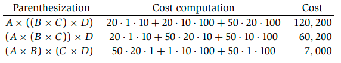
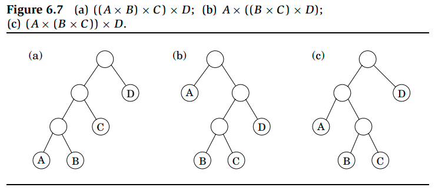

# Week 6, Lecture 2

## Knapsack
<pre>
During a theft, a thief discovers far more valuables than he expected and must pick what to keep. His bag (or "knapsack") can only carry a total weight of W pounds. There are n products to choose from, each with a different weight w<sub>1</sub>,..., w<sub>n</sub> and a different dollar value v<sub>1</sub>,..., v<sub>1</sub>. What is the most valuable combination of items he can cram into his bag?
There are two versions of this problem: with and without repetition of items.
</pre>

### Knapsack with repetition:
<pre>
What are the subproblems, as is usually the case in dynamic programming? In this situation, we can reduce the size of the original problem by looking at smaller knapsack capacities w <= W,
    K(w) = maximum value achievable with a knapsack of capacity w
Is it possible to break this down into smaller subproblems? If item i is part of the optimal solution to K(w), then removing it from the knapsack leaves an optimal solution to K (w - w<sub>i</sub>). 
In other words, K(w) is simply K(w − w<sub>i</sub>) + v<sub>i</sub> , for some i.
    K(w) = max{K(w − w<sub>i</sub>) + v<sub>i</sub>}, i : w<sub>i</sub> ≤ w
where maximum over an empty set is 0.
</pre>
```python
K (0) = 0
for w = 1 to W:
    K(w) = max{K(w − wi) + vi : wi ≤ w}
return K (W)
```
<pre>
In left-to-right order, this method fills in a one-dimensional table of length W + 1. The overall running time is O(nW) because each entry can take up to O(n) time to be computed.
The underlying DAG for this algorithm comes out to be finding the longest path in a DAG.
</pre>

### Knapsack without repetition:
<pre>
Our previous subproblems are now utterly obsolete. Knowing that the value K (w - w<sub>n</sub>) is very large, for example, is useless because we don't know if item n has already been used up in this partial solution. As a result, we must refine our idea of a subproblem to include more information about the items in use.
We add a second parameter, 0 ≤ j ≤ n:
    K(w, j) = maximum value achievable using a knapsack of capacity w and items 1,..., j.
The answer we want is K(W, n).
How can a subproblem K (w, j) be expressed in terms of smaller subproblems? It's as simple as that: either item j is required to obtain the optimal value, or it isn't:
    K(w, j) = max{K(w − w<sub>j</sub>, j − 1) + v<sub>j</sub>, K(w, j − 1)}
(The first case is invoked only if w<sub>j</sub> ≤ w) 
So we can express K(w, j) in terms of subproblems K(·, j − 1).
Filling out a two-dimensional table with W + 1 rows and n + 1 columns is the next step in the process. Each table entry takes constant time, so even though the table is much larger than before, the running time is the same, O(nW).
</pre>
```python
Initialize all K(0, j) = 0 and all K(w, 0) = 0
for j = 1 to n:
    for w = 1 to W:
        if wj > w: K(w, j) = K(w, j − 1)
        else: K(w, j) = max{K(w, j − 1), K(w − wj, j − 1) + vj}
return K(W, n)
```

## Chain Matrix Multiplication
<pre>
Assume we need to multiply four matrices, A× B × C × D, with dimensions of 50 × 20, 20 × 1, 1 × 10, and 10 × 100, respectively. Iteratively multiplying two matrices at a time will be required. Multiplication of matrices is not commutative (in general, A × B != B × A), but it is associative (for example, A × (B × C) = (A × B) × C). Depending on how we parenthesize our product of four matrices, we can compute it in a variety of ways.
To get a good approximation, multiplying a m × n  matrix by a n × p matrix takes mnp multiplications. Let's look at a few different approaches to evaluate A × B × C × D using this formula:
</pre>

<pre>
As you can see, the order in which the multiplications are performed has a significant impact on the ultimate running time!
If we want to compute A<sub>1</sub> × A<sub>2</sub> ×···× A<sub>n</sub>, where the A<sub>i</sub>'s are matrices with dimensions m<sub>0</sub> × m<sub>1</sub>, m<sub>1</sub> × m<sub>2</sub>,..., m<sub>n-1</sub> × m<sub>n</sub>, how do we figure out the best order? 
The first thing to note is that a specific parenthesization may be represented very naturally by a binary tree, with individual matrices corresponding to the leaves, the root representing the end product, and internal nodes representing intermediate products. The numerous full binary trees with n leaves, whose number is exponential in n, correspond to the potential multiplication orders.
</pre>

<pre>
We won't be able to try every tree, therefore we'll have to rely on dynamic programming instead.
The binary trees imply that for a tree to be optimal, all of its subtrees must be optimal as well. What subproblems do the subtrees correspond to?
They are products of the form A<sub>i</sub> × A<sub>i+1</sub> ×···× A<sub>j</sub>. For 1 ≤ i ≤ j ≤ n, define:
    C(i, j) = minimum cost of multiplying A<sub>i</sub> × A<sub>i+1</sub> ×···× A<sub>j</sub>
The number of matrix multiplications, |j - i|, determines the size of this subproblem. When i = j, the smallest subproblem is that there is nothing to multiply, so C(i,i) = 0.
For j > i, consider the optimal subtree for C (i, j). The first branch in this subtree, the one at the top, will split the product in two pieces, of the form A<sub>i</sub> ×···× A<sub>k</sub> and A<sub>k+1</sub> ×···× A<sub>j</sub>, for some k between i and j. The cost of the subtree is then calculated as the sum of the costs of these two partial products plus the cost of combining them:  C(i, k) + C(k + 1, j) + m<sub>i-1</sub> · m<sub>k</sub> · m<sub>j</sub>
And all we have to do now is discover the smallest splitting point k:
    C(i, j) = min{C(i, k) + C(k + 1, j) + m<sub>i-1</sub> · m<sub>k</sub> · m<sub>j</sub>}; i ≤ k < j
</pre>
```python
(s denotes subproblem size)
for i = 1 to n: C(i,i) = 0
for s = 1 to n − 1:
    for i = 1 to n − s:
        j = i + s
        C(i, j) = min{C(i, k) + C(k + 1, j) + mi−1 · mk · mj : i ≤ k < j}
return C(1, n)
```
<pre>
Each of the subproblems forms a two-dimensional table, with each entry taking O(n) time to compute. As a result, the total running time is O(n<sup>3</sup>).
</pre>