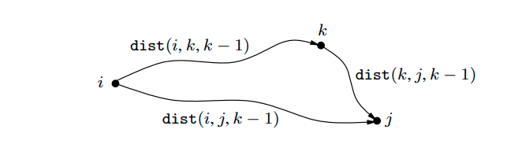
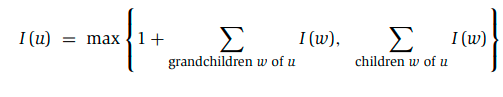

# Week 7, Lecture 1

## Shortest Reliable Paths
<pre>
We'd prefer to avoid pathways with too many edges in some circumstances.
Assume we have a graph G with edge lengths, two nodes s and t, and an integer k, and we want to find the shortest path from s to t that uses at most k edges.
Is it possible to adapt Dijkstra's algorithm to this new task quickly? That algorithm, however, focuses on the length of each shortest trip rather than “remembering” the number of hops in the path, which is now a critical piece of information.
The trick in dynamic programming is to pick subproblems carefully such that all important information is remembered and carried forward. Let us define dist(v,i) as the length of the shortest path from s to v that employs i edges for each vertex v and each integer i <= k. The starting values dist(v, 0) are ∞ for all vertices except
s, for which it is 0. And, naturally, the universal update equation is:
    dist(v,i) = min{dist(u,i − 1) + (u, v)}; (u,v) ∈ E
</pre>

## All Pairs Shortest Paths
<pre>
Is there a subproblem that computes distances between all pairs of vertices in a graph? Solving the problem for a growing number of pairings or beginning points is ineffective since it reverts to the O(|V|<sup>2</sup>|E|) algorithm.
The shortest path u → w<sub>1</sub> →···→ w<sub>l</sub> → v between u and v uses some number of intermediate nodes — possibly none. Let's say we don't allow intermediary nodes at all. Then we can solve all-pairs shortest pathways at once: if the direct edge (u, v) exists, the shortest path from u to v is simply the direct edge (u, v). What if we gradually broaden the range of acceptable intermediate nodes? This can be done one node at a time, with the shortest path lengths being updated at each iteration. This set eventually grows to encompass all of V, at which time all vertices are permitted to be on all pathways, and we have discovered the genuine shortest paths between the graph's vertices!
To put it another way, number the vertices in V as {1, 2,..., n}, and let dist(i, j, k) signify the length of the shortest path from i to j using only nodes {1, 2,..., k} as intermediates. Initially, if a direct edge exists between i and j, dist(i, j, 0) is the length of that edge; otherwise, it is ∞.
What happens when we add an extra node k to the intermediate set? We must evaluate all i, j pairs to see if using k as an intermediate place allows us to go faster from i to j. But it's simple: the shortest path from i to j using k and perhaps other lower-numbered intermediary nodes only passes through k once (We presume there are no negative cycles). And, using only lower-numbered vertices, we've already estimated the length of the shortest path from I to k and from k to j:
</pre>

<pre>
Thus, using k gives us a shorter path from i to j if and only if:
    dist(i, k, k − 1) + dist(k, j, k − 1) < dist(i, j, k − 1)
If this is the case, dist(i, j, k) should be updated accordingly.
</pre>
```python
for i = 1 to n:
    for j = 1 to n:
        dist(i, j, 0) = ∞
for all (i, j) ∈ E:
    dist(i, j, 0) = (i, j)
for k = 1 to n:
    for i = 1 to n:
        for j = 1 to n:
            dist(i, j, k) = min{dist(i, k, k − 1) + dist(k, j, k − 1), dist(i, j, k − 1)}
```
<pre>
This is the Floyd-Warshall algorithm which, clearly, takes O(|V|<sup>3</sup>) time.
</pre>

## Independent Sets in Trees
<pre>
A subset of nodes S ⊂ V is an independent set of graph G = (V, E ) if there are no edges between them.
When the graph is a tree, the problem can be solved using dynamic programming in linear time. What are the subproblems that should be addressed? We found that the layered structure of a tree provides a natural formulation of a subproblem in the chain matrix multiplication problem—as long as one node of the tree has been recognised as a root.
Begin by establishing a root at any node r. Each node now has a subtree—the one that hangs off of it. This instantly raises the possibility of subproblems:
    I(u) = size of largest independent set of subtree hanging from u
I(r) is our ultimate goal.
Dynamic programming always works from the bottom up in the rooted tree, from smaller subproblems to larger ones. Assume we know the biggest independent sets for all subtrees below a given node u; in other words, we know I(w) for all w of u's descendants. How do we calculate I(u)? Let's divide the calculation into two scenarios: Any independent set either contains u or does not contain u:
</pre>

<pre>
If the independent set contains u, we receive one point; however, we are not permitted to include u's children, so we continue on to the grandchildren. This is the formula's first case. If we don't include u, on the other hand, we don't earn a point for it, but we can move on to its children.
The number of vertices equals the number of subproblems. The running time can be made linear (O(|V|+|E|)) with a little care.
</pre>
