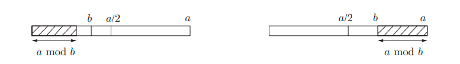
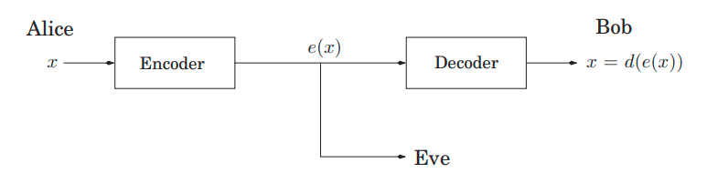
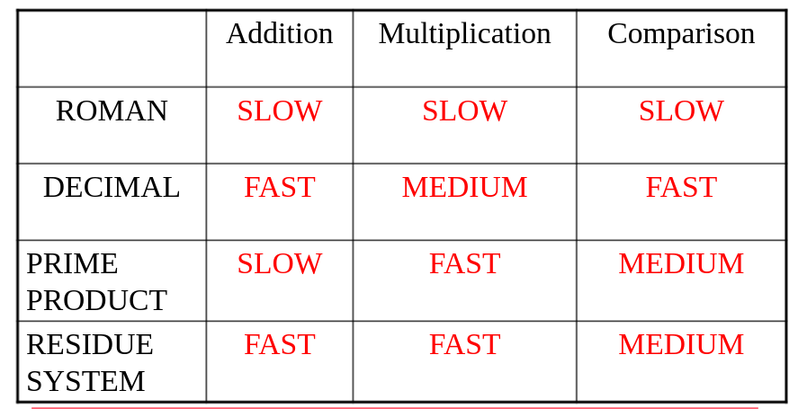
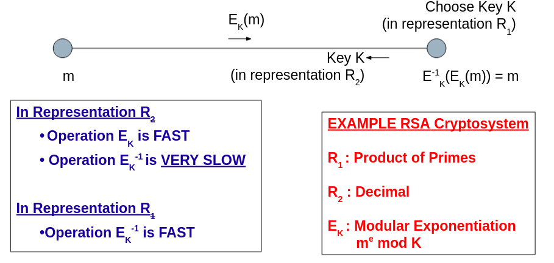
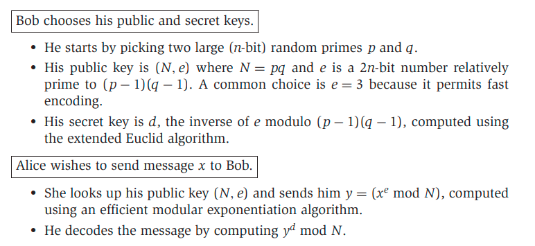

# Week 8, Lecture 2

## Euclid's Algorithm for GCD
<pre>
Euclid’s rule:
    If x and y are positive integers with x ≥ y, then gcd(x, y) = gcd(x mod y, y).
Proof:
It is enough to show that gcd(x, y) = gcd(x − y, y) from
which the one stated above can be derived by repeatedly subtracting y from x:
  Any integer that divides both x and y must also divide x − y, so gcd(x, y) ≤ gcd(x − y, y). Similarly, any integer that divides both x − y and y must also divide both x and y, so gcd(x, y) ≥ gcd(x − y, y).
</pre>
```python
function Euclid(a, b)
Input: Two integers a and b with a ≥ b ≥ 0
Output: gcd(a, b)

if b = 0: return a
return Euclid(b, a mod b)
```
<pre>
Euclid's rule allows us to write down a beautiful recursive procedure, and the rule's soundness is obvious.
To calculate its execution time, we must first determine how quickly the parameters (a, b) decrease with each subsequent recursive call. Arguments (a, b) become (b, a mod b) in a single round: their order is changed, and the larger of them, a, is reduced to a mod b. This is a significant reduction.

Lemma: If a ≥ b, then a mod b < a/2.
Observe that either b ≤ a/2 or b > a/2. If b ≤ a/2, then we have a mod b < b ≤ a/2; and if b > a/2, then a mod b = a − b < a/2.
</pre>

<pre>
This means that after any two consecutive rounds, the value of both arguments, a and b, is at the very least halved - their length is reduced by at least one bit. If they start off as n-bit integers, they'll get to the base case in 2n recursive calls. The total time is O(n<sup>3</sup>) because each call involves quadratic time division.
</pre>

## Extension of Euclid’s Algorithm
<pre>
Lemma: If d divides both a and b, and d = ax + by for some integers x and y, then necessarily d = gcd(a, b).
Proof:
By the first two conditions, d is a common divisor of a and b and so it cannot exceed the greatest common divisor ==> d ≤ gcd(a, b). As gcd(a, b) is a common divisor of a and b, it must also divide ax + by = d, ==> gcd(a, b) ≤ d. Combining these, d = gcd(a, b).
</pre>
```python
function extended−Euclid(a, b)
Input: Two positive integers a and b with a ≥ b ≥ 0
Output: Integers x, y, d such that d = gcd(a, b) and ax + by = d

if b = 0: return (1, 0, a)
(x', y', d) = extended−Euclid(b, a mod b)
return (y', x' − ⌊a/b⌋y', d)
```
<pre>
Lemma: For any positive integers a and b, the extended Euclid algorithm returns
integers x, y, and d such that gcd(a, b) = d = ax + by.
Proof:
The first thing to check is that the expanded algorithm is identical to the original if the x's and y's are ignored. So, at least we compute d = gcd(a, b).
For the rest, the algorithm's recursive structure implies proof by induction. Because the recursion ends when b = 0, induction on the value of b is convenient.
The base case b = 0 is straightforward to check. Now choose a larger number for b. The algorithm finds gcd(a, b) by calling gcd(b, a mod b). Since a mod b < b, we can apply the inductive hypothesis to this recursive call and conclude that the x' and y' it returns are correct:
    gcd(b, a mod b) = bx' + (a mod b)y'
Writing (a mod b) as (a − ⌊a/b⌋b), 
    d = gcd(a, b) = gcd(b, a mod b) = bx' + (a mod b)y' = bx' + (a − ⌊a/b⌋b)y' = ay' + b(x' − ⌊a/b⌋y')
Therefore d = ax + by with x = y' and y = x' − ⌊a/b⌋y', thus validating the algorithm’s behavior on input(a, b).
</pre>

## Modular Division
<pre>
Every number a = 0 has an inverse, 1/a, in real arithmetic, and dividing by a is the same as multiplying by this inverse. A similar notion can be found in modular arithmetic.
    We say x is the multiplicative inverse of a modulo N if ax ≡ 1 (mod N).
We can be certain that gcd(a, N) divides ax mod N, because this latter quantity can be written in the form ax + kN. 
So if gcd(a, N) > 1,then ax !≡ 1 mod N, regardless of what x is, and hence a cannot have a
multiplicative inverse modulo N.
This is the single case when a is not invertible. When gcd(a, N) = 1(a and N are relatively prime), the extended Euclid algorithm gives us integers x and y such that ax + Ny = 1, which means that ax ≡ 1 (mod N). As a result, x is the sought-after inverse of a.
Modular division theorem:
For any a mod N, a has a multiplicative inverse modulo N if and only if it is relatively prime to N.
When this inverse exists, it can be found in time O(n<sup>3</sup>) (where as usual n denotes the number of bits of N) by running the extended Euclid algorithm.
This overcomes the problem of modular division: when working modulo N, we can only divide by numbers that are relatively prime to N. We then multiply by the inverse to complete the division.
</pre>

### Fermat's Little Theorem
<pre>
Lemma: If p is prime, then for every 1 ≤ a < p,
        a<sup>p−1</sup> ≡ 1 (mod p)
Proof:
Let S be the nonzero integers modulo p; that is, S = {1, 2,..., p − 1}. 
The resulting integers are all distinct and nonzero when the elements of S are multiplied by a modulo p. They must be a permutation of S because they are in the range [1, p-1].
The numbers a · i mod p are distinct because if a · i ≡ a · j (mod p), then dividing both sides by a gives i ≡ j (mod p). They are nonzero since a · i ≡ 0 ⇒ i ≡ 0 in the same way. (We can also divide by a because it is nonzero and so prime to p)
Set S can now be written in two different ways:
    S = {1, 2,..., p − 1}={a · 1 mod p, a · 2 mod p,..., a · (p − 1) mod p}
In each of these representations, we can multiply its elements to yield:
    (p − 1)! ≡ a<sup>p−1</sup> · (p − 1)! (mod p)
</pre>

## Cryptography
<pre>
The classic cryptography environment can be defined by a cast of three characters: Alice and Bob, who want to converse privately, and Eve, an eavesdropper who will go to tremendous efforts to learn what they are saying.
Let's pretend Alice wants to send her friend Bob a specific message x, written in binary. She encrypts it as e(x), sends it through, and Bob decodes it using his d(.) decryption function: d(e(x)) = x. The relevant modifications of the messages are e(.) and d(.).
</pre>

<pre>
Alice and Bob are concerned that the eavesdropper, Eve, will intercept e(x): she could, for example, be a network sniffer.
However, the encryption function e(.) should be designed in such a way that Eve cannot do anything with the information she has gathered without knowing d(.). To put it another way, knowing e(x) informs her very nothing about what x might be.

RSA and other public-key methods are sophisticated and tricky: they allow Alice to deliver a message to Bob without ever meeting him. Bob's encryption function, e(.), is publicly available, and Alice can use it to encrypt and digitally lock her message. The decryption function d(.) is only known by Bob, and it is the key to fast unlocking this digital lock.
The argument is that to lock and unlock the message, Alice and Bob only need to execute simple computations, which any pocket computing device could handle. To unlock the message without the key, Eve must do operations such as factoring enormous numbers, which necessitates more computing power than the world's most powerful computers combined. 
Secure Web commerce, such as sending credit card details to companies over the Internet, is made possible by this persuasive guarantee.
</pre>




### RSA
<pre>
The RSA algorithm is mainly reliant on number theory. 
Consider Alice's messages to Bob as numbers modulo N; messages greater than N can be split down into smaller chunks. The encryption function will thus be a bijection on {0, 1,..., N − 1}, with the decryption function being the inverse. 
What N numbers should be used, and which bijection should be employed?
Pick any two primes p and q and let N = pq. For any e relatively prime to (p − 1)(q − 1):
1. The mapping x → x<sup>e</sup> mod N is a bijection on {0, 1,..., N − 1}
2. Furthermore, the inverse mapping is simple to implement:  let d be the inverse of e modulo (p − 1)(q − 1). Then for all x ∈ {0,..., N − 1},
        (x<sup>e</sup>)<sup>d</sup> ≡ x mod N
The first property indicates that the mapping x → x<sup>e</sup> mod N is a valid method of encoding messages x; no data is lost. As a result, if Bob makes  (N, e) his public key, anyone can use it to send him encrypted messages. 
The second attribute describes how decryption is accomplished. Bob should keep the value d as his secret key, which he can use to decode each message he receives by simply increasing it to the dth power modulo N.
Proof:
If the mapping x → x<sup>e</sup> mod N is invertible, it must be a bijection; hence statement 2 implies statement 1. To show proposition 2, we first see that because e is relatively prime to this integer, it is invertible modulo (p-1)(q-1).
To see that (x<sup>e</sup>)<sup>d</sup> ≡ x mod N, we examine the exponent: since ed ≡ 1 mod (p − 1)(q − 1), we can write ed in the form 1 + k(p − 1)(q − 1) for some k.
We must now demonstrate that the difference:
    x<sup>ed</sup> − x = x<sup>1+k(p−1)(q−1)</sup> − x
is always 0 modulo N.
Because Fermat's little theorem may be used to simplify the second form of the expression, it is more convenient. It is divisible by p (since x<sup>p−1</sup> ≡ 1 mod p) and likewise by q. Since p and q are primes, this expression must also be divisible by their product N.
Hence x<sup>ed</sup> − x = x<sup>1+k(p−1)(q−1)</sup> − x ≡ 0 (mod N).
</pre>
