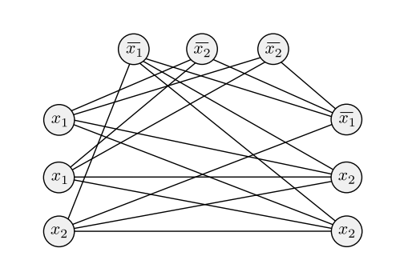

# Week 9, Lecture 2

## NP
<pre>
A verifier for a language A is an algorithm V , where:
    A = {w| V accepts ⟨w, c⟩ for some string c}
We only measure a verifier's time in terms of the length of w, therefore a polynomial time verifier runs in polynomial time in the length of w. If a language A has a polynomial time verifier, it is polynomially verifiable.
A verifier employs additional information, denoted by the symbol c in the above definition, to determine whether or not a string w is a member of A.
This data is referred to as a certificate or proof of membership in A. It is worth noting that for polynomial verifiers, the certificate has a polynomial length (in the length of w) because that is all the verifier can access within its time bound.

NP is the class of languages that have polynomial time verifiers.
The term NP comes from nondeterministic polynomial time and is derived from an alternative characterization by using nondeterministic polynomial time Turing machines. Problems in NP are sometimes called NP-problems.
</pre>

### Example of Problems in NP

#### Clique
<pre>
In an undirected network, a clique is a subgraph in which every two nodes are connected by an edge. A k-clique is a clique made up of k nodes.
</pre>

<pre>
The clique problem asks if a graph includes a clique of a given size.
Let:
    CLIQUE = {⟨G, k⟩| G is an undirected graph with a k-clique}
We will now prove that CLIQUE is in NP.
Proof:
The following is a verifier V for CLIQUE:
V = On input ⟨⟨G, k⟩, c⟩:
    1. Test whether c is a subgraph with k nodes in G.
    2. Test whether G contains all edges connecting nodes in c.
    3. If both pass, accept; otherwise, reject.
</pre>

#### Subset-Sum
<pre>
We are provided a set of numbers x1,..., xk as well as a target number t. We want to know if the collection has a subcollection that adds up to t.
Hence,
    SUBSET-SUM = {⟨S, t⟩| S = {x1,..., xk}, and for some
    {y1,...,yl} ⊆ {x1,...,xk}, we have Σyi = t}
It is worth noting that {x1,..., xk} and {y1,...,yl} are considered multisets and hence allow for element repetition.
We will now prove that SUBSET-SUM is in NP.
Proof:
The following is a verifier V for SUBSET-SUM:
V = On input ⟨⟨S, t⟩, c⟩:
    1. Test whether c is a collection of numbers that sum to t.
    2. Test whether S contains all the numbers in c.
    3. If both pass, accept; otherwise, reject.
</pre>

#### NP vs co-NP
<pre>
It is worth noting that the complements of these sets, CLIQUE and SUBSET-SUM, are not clearly members of NP. 
It appears that verifying that something is not present is more difficult than verifying that it is present.
We create a new complexity class, co-NP, that encompasses languages that are complements of languages in NP. We aren't sure if co-NP is distinct from NP.
</pre>

## The P vs NP Question
<pre>
As previously stated, NP is the class of languages that can be solved in polynomial time on a nondeterministic Turing machine; or, equivalently, it is the class of languages that can be verified in polynomial time.
P denotes the set of languages whose membership can be determined in polynomial time.
This information is summarised here, where we loosely refer to polynomial time solvable as solvable "quickly":
    P = the class of languages for which membership can be decided quickly
    NP = the class of languages for which membership can be verified quickly
</pre>

## Polynomial Time Reducibility
<pre>
A function f : Σ∗→Σ∗ is a polynomial time computable function if some polynomial time Turing machine M exists that halts with just f(w) on its tape, when started on any input w.
Language A is polynomial time mapping reducible, or simply polynomial time reducible, to language B, written A ≤P B, if a polynomial time computable function f : Σ∗→Σ∗ exists, where for every
w,
    w ∈ A ⇐⇒ f(w) ∈ B
The function f is called the polynomial time reduction of A to B.
Theorem: If A ≤P B and B ∈ P, then A ∈ P.
Proof:
Let M denote the polynomial time algorithm that determines B, and f denote the polynomial time reduction from A to B. As follows, we describe a polynomial time algorithm N for choosing A:
N = On input w:
    1. Compute f(w).
    2. Run M on input f(w) and output whatever M outputs.
We have w ∈ A whenever f(w) ∈ B because f is a reduction from A to B. Thus, M accepts f(w) whenever w ∈ A.
Furthermore, N is polynomial in time since each of its two stages is polynomial in time. It is worth noting that stage 2 executes in polynomial time because the product of two polynomials is also a polynomial.
</pre>

### 3SAT
<pre>
3SAT is a subset of the satisfiability problem in which all formulas take a specific form.
A literal is a Boolean variable or a negated Boolean variable, as in x or x'.
A clause is several literals connected with ∨s, as in (x1 ∨ x2' ∨ x3' ∨ x4). 
A Boolean formula is in conjunctive normal form, called a cnf-formula, if it comprises several clauses connected with ∧s, as in:
    (x1 ∨ x2' ∨ x3' ∨ x4) ∧ (x3 ∨ x5' ∨ x6) ∧ (x3 ∨ x6')
It is a 3cnf-formula if all the clauses have three literals, as in:
    (x1 ∨ x2' ∨ x3') ∧ (x3 ∨ x5' ∨ x6) ∧ (x3 ∨ x6' ∨ x4) ∧ (x4 ∨ x5 ∨ x6)

3SAT = {⟨φ⟩| φ is a satisfiable 3cnf-formula}
If a cnf-formula is satisfied by an assignment, each clause must have at least one literal that evaluates to 1.
</pre>

### Polynomial Time Reduction from 3SAT to CLIQUE
<pre>
Let φ be a formula with k clauses such as:
    φ = (a1 ∨ b1 ∨ c1) ∧ (a2 ∨ b2 ∨ c2) ∧ ··· ∧ (ak ∨ bk ∨ ck)
The reduction f generates the string ⟨G, k⟩, where G is an undirected graph
defined as follows:
G's nodes are grouped into k groups of three nodes each, known as triples, t1,..., tk. 
Each triple corresponds to one of the clauses in φ, and each node in a triple corresponds to a literal in the associated clause. Label each node of G with its corresponding literal in φ.
G's edges connect all but two types of node pairs in G. There are no edges connecting nodes in the same triple, and no edges exist between two nodes with contradicting labels, as in x2 and x2'.
The following figure illustrates this when φ = (x1 ∨ x1 ∨ x2) ∧ (x1' ∨ x2' ∨ x2') ∧ (x1' ∨ x2 ∨ x2).
</pre>

<pre>
Now we'll show why this structure works. We prove that φ is satisfiable if and only if G has a k-clique.
Assume φ has a suitable assignment. Every clause in that satisfying assignment contains at least one literal. We choose one node in each triple of G that corresponds to a true literal in the fulfilling assignment. If more than one literal is true in a given clause, we arbitrarily select one of the true literals.
The nodes that were just chosen form a k-clique. We chose k nodes because we wanted one for each of the k triples.Because no pair of selected nodes fits one of the previously specified exceptions, each pair is united by an edge.
They couldn't be from the same triple because we only chose one node from each. Because the related literals were both true in the satisfied assignment, they couldn't have contradicting labels. As a result, G has a k-clique.
Let's say G has a k-clique. Because nodes in the same triple aren't connected by edges, no two of the clique's nodes appear in the same triple. As a result, each of the k triples contains one of the k clique nodes.
We assign truth values to the variables of φ in order to make each literal denoting a clique node true. This is always conceivable since two nodes with contradicting labels are not connected by an edge and so cannot both be in the clique.
Because each triple contains a clique node, and thus each clause contains a literal that is assigned TRUE, this assignment to the variables satisfies φ. As a result, φ is satisfiable.
</pre>

## NP-Completeness
<pre>
A language B is NP-complete if it satisfies two conditions:
    1. B is in NP.
    2. every A in NP is polynomial time reducible to B.

Theorem: If B is NP-complete and B ≤P C for C in NP, then C is NP-complete.
Proof:
We already know that C exists in NP, so we must demonstrate that every A in NP is polynomial time reducible to C. Because B is NP-complete, any language in NP is polynomial time reducible to B, and B is polynomial time reducible to C. 
Polynomial time reductions are additive; that is, if A is polynomial time reducible to B and B is polynomial time reducible to C, then A is polynomial time reducible to C. As a result, every language in NP is polynomial time reducible to C.

The Cook–Levin theorem proves that SAT is NP-complete. We can also prove 3SAT is NP-complete by showing
that SAT polynomial time reduces to 3SAT.
</pre>