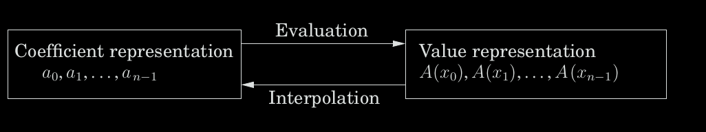
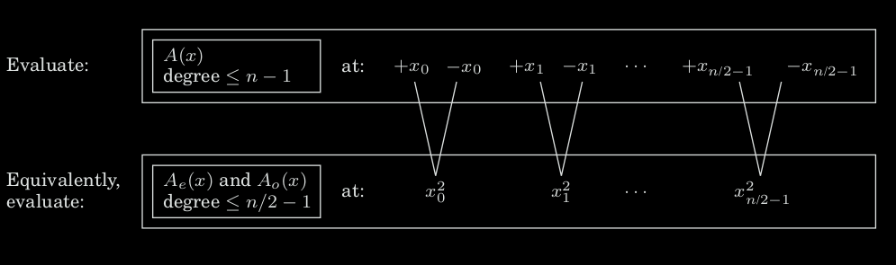
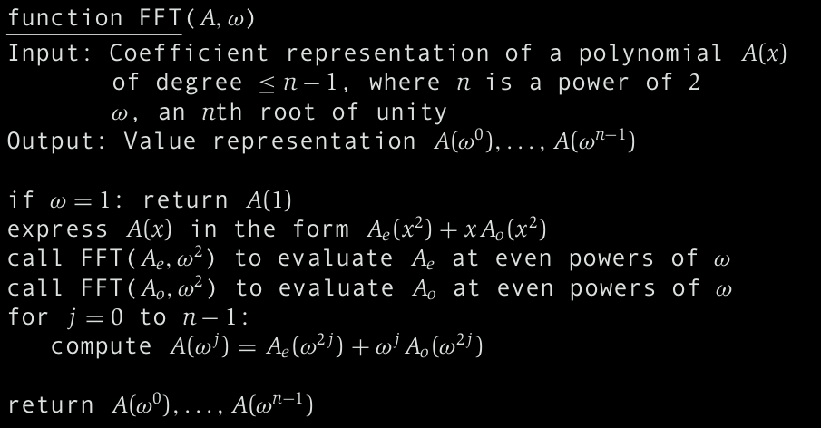
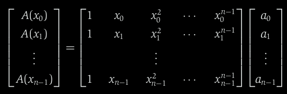
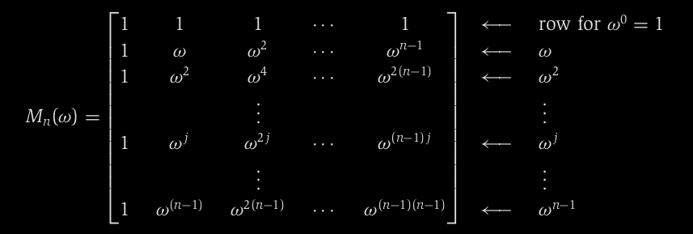
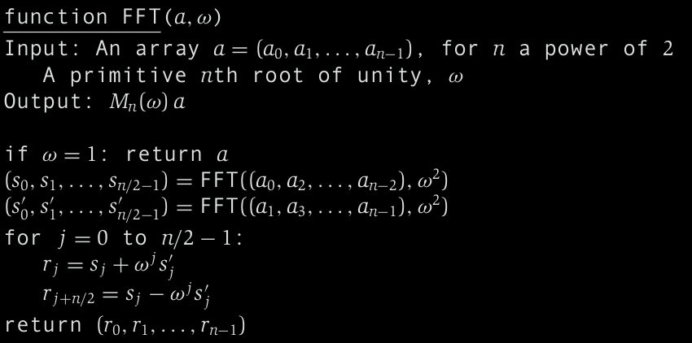

# Week 3, Lecture 1

## Product of two d-degree polynomials

The product of two degree-d polynomials is a polynomial of degree 2d.

Let A(x) = a0 + a1x + · · · + adxd and B(x) = b0 + b1x + · · · + bdxd,
their product,

 C(x) = A(x) · B(x) = c0 + c1x + · · · + c2dx2d ,
 has coefficients,
  ck = a0bk + a1bk-1 + · · · + akb0 

(for i > d, take ai and bi to be zero). Computing ck from this formula takes O(k) steps, and finding all 2d + 1 coefficients would therefore require O(d2) time.
But there exists a better solution!

### Alternative representation of polynomials:

A degree-d polynomial is uniquely characterized by its values at any d + 1 distinct points.
Fix any distinct points x0, . . . , xd. We can specify a degree-d polynomial A(x) = a0 + a1x + · · · + adxd by either one of the following:

1. Its coefficients a0, a1, . . . , a0
2. The values A(x0), A(x1), . . . , A(x0)

Since the product C(x) has degree 2d, it is completely determined by its value at any 2d + 1 points. And its value at any given point z is easy enough to figure out, just A(z) times B(z). Thus polynomial multiplication takes linear time in the value representation.
So we need to first translate from coefficients to values which is just a matter of evaluating the polynomial at the chosen points; then multiply in the value representation, and finally translate back to coefficients (interpolation)

#### Algorithm:
Input: Coefficients of two polynomials, A(x) and B(x), of degree d

Output: Their product C = A · B

Selection:
Pick some points x0, x1, . . . , xn-1, where n ≥ 2d + 1

Evaluation:
Compute A(x0), A(x1), . . . , A(xn-1) and B(x0), B(x1), . . . , B(xn-1)

Multiplication:
Compute C (xk) = A(xk)B(xk) for all k = 0, . . . , n − 1

Interpolation:
Recover C (x) = c0 + c1x + · · · + c2dx2d

The selection step and the n multiplications take just linear time. But evaluating a
polynomial of degree d ≤ n at a single point takes O(n) steps. Hence, the total complexity is O(n2).

But there exists a better algorithm which does it in just O(nlog(n)) time, for a particularly clever choice of x0, . . . , xn-1 in which the computations required by the individual points overlap with one another and can be shared.

### Fast Fourier Transform

We split A(x) into its odd and even powers,

A(x) = Ae(x2) + xAo(x2),

where Ae(·), with the even-numbered coefficients, and Ao(·), with the odd-numbered coefficients, are polynomials of degree ≤ n/2 − 1.

Given paired points ±xi, the calculations needed for A(xi) can be recycled toward computing A(−xi):

A(xi) = Ae((xi)2) + xiAo((xi)2)

A(-xi) = Ae((xi)2) - xiAo((xi)2)

So, evaluating A(x) at n paired points ±x0, . . . , ±xn/2-1 reduces to evaluating Ae(x) and Ao(x) (which each have half the degree of A(x)) at just n/2 points - (xo)2, . . . , (xn/2-1)2

The original problem of size n is recasted as two subproblems of size n/2, followed by some linear-time arithmetic. By recursion, we get a divide-and-conquer procedure:

T(n) = 2T(n/2) + O(n),

whose time complexity is O(nlog(n)).

But we have a problem: The plus-minus trick only works at the top level of the recursion. To recurse at the next level, we need the n/2 evaluation points (xo)2, . . . , (xn/2-1)2 to be themselves plus-minus pairs. But a square cannot be negative. 
Hence, we need to use complex numbers.

We choose the complex nth roots of unity, that is, the n complex solutions to the equation zn = 1.
So we designed the FFT, a way to move from coefficients to values in time just
O(nlog(n)), when the points {xi} are complex nth roots of unity (1, ω, ω2, . . . , ωn-1)

{values} = FFT({coefficients}, ω)

FFT (polynomial formulation)

#### Interpolation:

It turns out that,

{coefficients} = (1/n)FFT({values}, ω−1)

Interpolation is thus solved using the same FFT algorithm, but called with ω−1 in place of ω.

##### Proof:

Let the above matrix be M:
Evaluation is multiplication by M, while interpolation is multiplication by M−1

Mn(ω)−1 = (1/n)Mn(ω−1) (Inversion formula)

#### FFT Algorithm

Finally, this divide-and-conquer strategy leads to FFT algorithm whose time complexity is O(nlog(n)).

